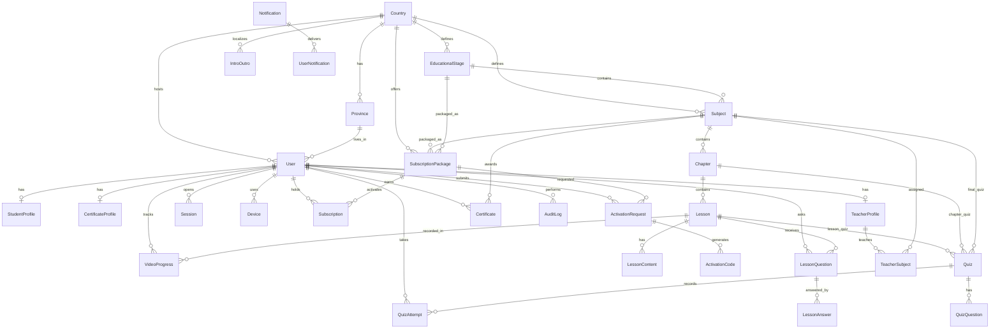

# U Learn – ER Diagram

## Relationship Notes

| Parent | Child | Cardinality |
|--------|-------|-------------|
| Country | EducationalStage, Subject, Package | 1:N |
| Subject | Chapter | 1:N |
| Chapter | Lesson | 1:N |
| Lesson | LessonContent, Quiz, Questions | 1:N |
| User | Subscription, Progress, Attempts | 1:N |
| User ↔ Subject | Certificate | unique pair |
| User ↔ Lesson | VideoProgress | unique pair |
